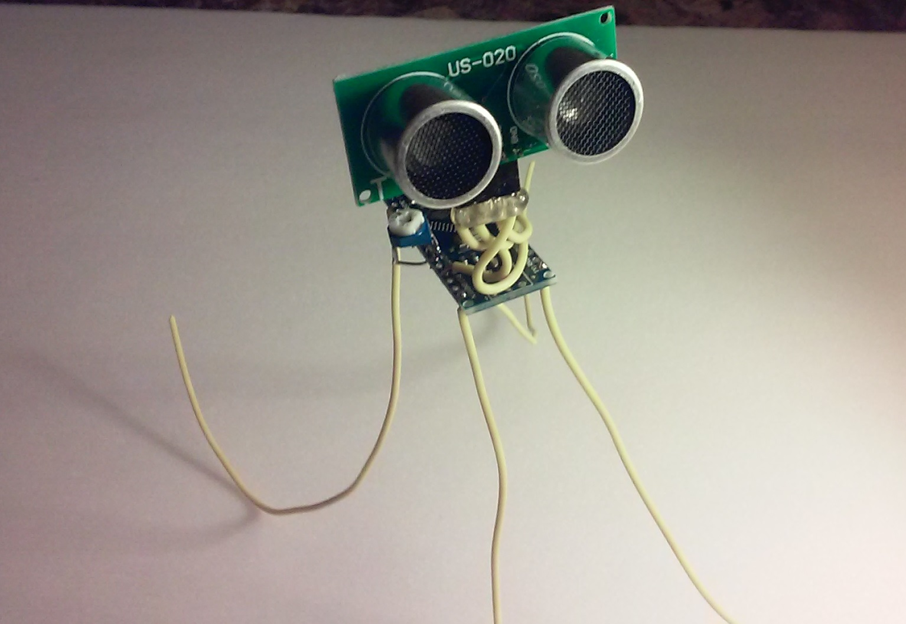

This cute little device will allow you to lock your workstation automatically when you are away 

 

<H1>Setup</h1>
<ul>
<li>Install Python 2.7, windows exe installer is found here: <a href="https://www.python.org/download/releases/2.7/">https://www.python.org/download/releases/2.7/</a></li>
<li>Install pyserial library, windows .exe installer is found Here: <a href="https://pypi.python.org/pypi/pyserial">https://pypi.python.org/pypi/pyserial</a></li>
<li>Unzip and Install the windows drive for CH34 usb serial device, .zip file is here: <a href="CH34Driver.zip">CH34Driver.zip</a></li>
<li>The python script that runs in background will be sent to you when the product is ordered.</li>
</ul>