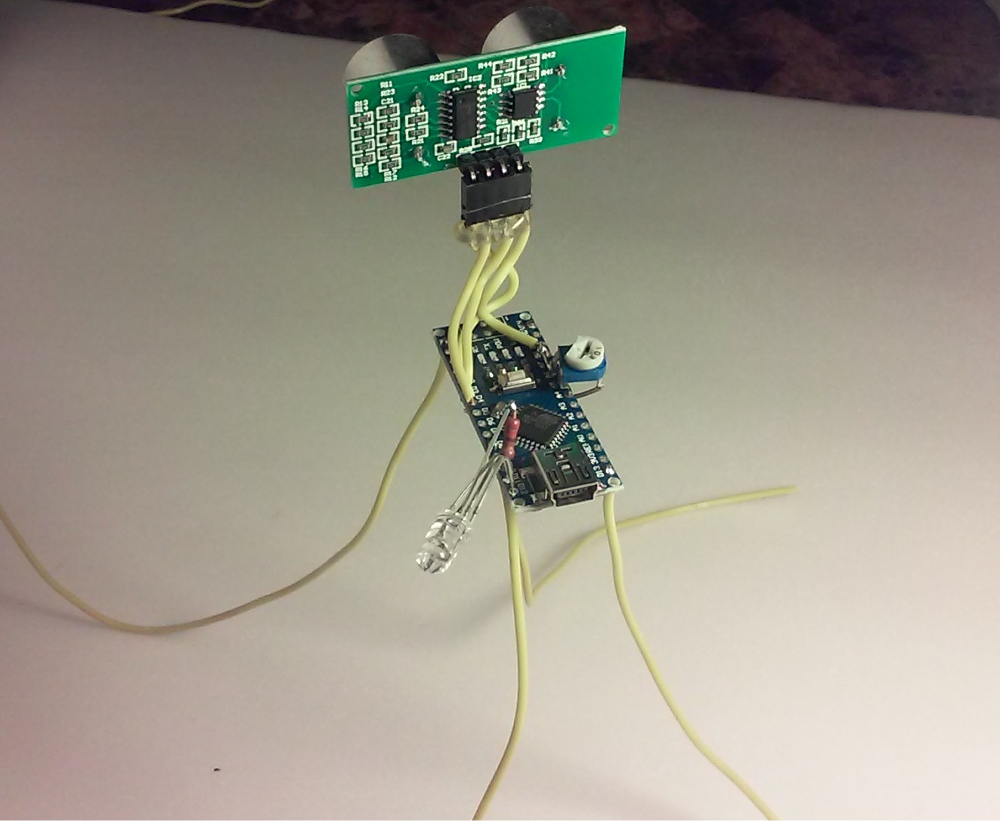
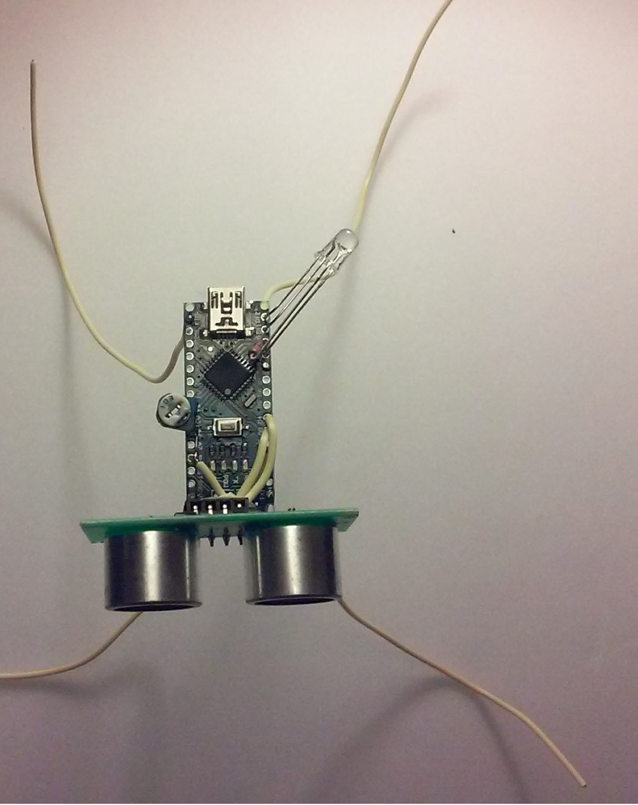

This cute little device will allow you to lock your workstation automatically when you are away 
 
 
 

<H1>Setup</h1>
<ul>
<li>Install Python 2.7</li>
<li>Install pyserial library, windows .exe installer is found Here: <a href="https://pypi.python.org/pypi/pyserial">https://pypi.python.org/pypi/pyserial</a></li>
<li>Install the windows drive for usb serial device ch30</li>
<li>Run python script</li>
</ul>