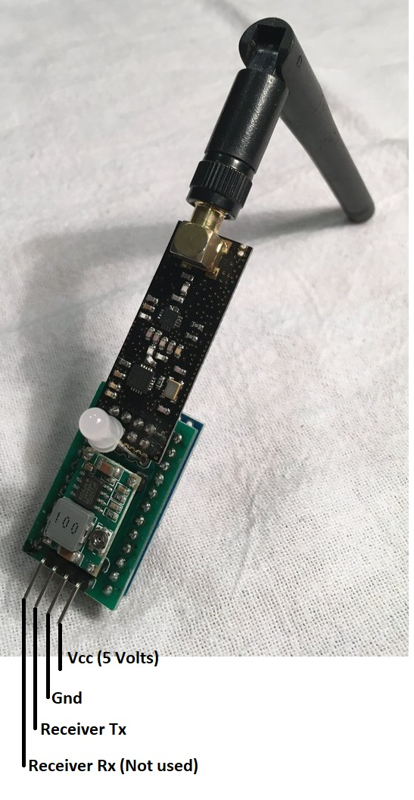

<h1>Nrf24l01 receiver</h1>
This receiver outputs at 9600 baud. 

List of default characters
<table border="2px solid">
<tr><th>Character</th><th>Description</th></tr>
<tr><td>L</td><td>Left track forward</td></tr>
<tr><td>l</td><td>Left track reverse</td></tr>
<tr><td>R</td><td>Right track forward</td></tr>
<tr><td>r</td><td>Right track reverse</td></tr>
<tr><td>T</td><td>Turret Clockwise (First button press)</td></tr>
<tr><td>t</td><td>Turret Counter-Clockwise (Second button press)</td></tr>
<tr><td>C</td><td>Third button press</td></tr>
<tr><td>c</td><td>Third button release</td></tr>
<tr><td>D</td><td>Fourth button press</td></tr>
<tr><td>F</td><td>Either Joystick push in (Used for Fire Command)</td></tr>
</table>
